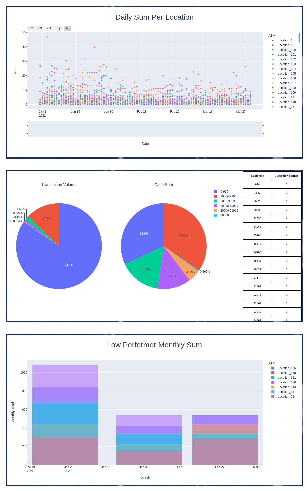

# Purpose

This project is a portfolio designed to showcase my backend and front end 
abilities as well as my operations proficiency. In essence it is a mock version
of a web application I built to help visualize data for a business. All data in
this portfolio is fake and randomized. The portfolio is a simpler and
streamlined version to highlight my skills and not be too repetitive.

# Technologies Implemented

- Python
- CSS
- HTML
- Flask
- SQLAlchemy
- PostgreSQL
- Google Cloud
- NGINX
- uWSGI
- Linux Terminal

### website preview


# The Process of Setting Up This Flask Web Application

### 1. Create Flask Web Application (run.py, config.py, __init__.py, views.py, html templates, CSS, etc.)

### 2. `pip freeze > requirements.txt` so that all dependencies for the flask web app can be installed on the Virtual Machine when we import the project from github

### 3. Create a virtual machine (VM) in google cloud

### 4. SSH into VM `ssh -p port# -i /path/to/private_key.pem username@server_IP`

### 5. Update the machine `sudo apt update -y;sudo apt upgrade -y`

### 6. clone, configure, and set global pyenv
```sh
git clone https://github.com/pyenv/pyenv.git ~/.pyenv

echo 'export PYENV_ROOT="$HOME/.pyenv"' >> ~/.bashrc
echo 'export PATH="$PYENV_ROOT/bin:$PATH"' >> ~/.bashrc
echo -e 'if command -v pyenv 1>/dev/null 2>&1; then\n  eval "$(pyenv init -)"\nfi' >> ~/.bashrc
exec "$SHELL"

sudo apt-get update; sudo apt-get install -y make build-essential libssl-dev
zlib1g-dev libbz2-dev libreadline-dev libsqlite3-dev wget curl llvm 
libncurses5-dev xz-utils tk-dev libxml2-dev libxmlsec1-dev libffi-dev liblzma-dev

pyenv install 3.10.6
pyenv global 3.10.6
```
### 7. Set up SSH Keys for Github and your server to clone the project
```sh
#server side run the following
-ssh-keygen -t rsa -b 4096 -C "your_email@example.com" #generating the key
-eval "$(ssh-agent -s)" #adding key to the ssh-agent
-ssh-add ~/.ssh/name_of_ssh_key #adding private key to ssh-agent

#Add the public key to github account... settings>SSH & GPG Keys > New SSH 
#paste the contents of public key into the text box

#now clone the project in the home directory
cd ~/

git clone git clone git@github.com:WorkingOnTheName/portfolio.git
```
### 8. Creating a virtual environment and installing dependencies for the app
```sh
cd app
python -m venv env
source env/bin/activate
pip install --upgrade pip
pip install -r requirements.txt
```
### 9. Create a systemD service file for the app
```sh
#Create systemD unit file
sudo nano /etc/systemd/system/app.service
#inside the file add
[Unit]
Description=A portfolio web app
After=network.target

[Service]
User=<yourusername>
Group=www-data
WorkingDirectory=/home/<yourusername>/app
Environment="PATH=/home/<yourusername>/app/env/bin"
Environment=“POSTGRES_URL='127.0.0.1'”
Environment="POSTGRES_USER='username'"
Environment="POSTGRES_PW='password'"
Environment="POSTGRES_DB='database_name'"
ExecStart=/home/<yourusername>/app/env/bin/uwsgi --ini app.ini

[Install]
WantedBy=multi-user.target

#hit Ctrl+c, y, enter to exit and save the systemD file

#start the app and enable it
sudo systemctl start app
sudo systemctl enable app
```

### 10. NGINX
```sh
#Install
sudo apt install nginx
#Firewall
sudo ufw allow 'Nginx HTTP'
#Configure NGINX
sudo nano /etc/nginx/sites-available/app
#paste inside the file then ctrl+c, y, enter to exit and save the info
server {
    listen 80;
    server_name <your_ip_address>;

    location / {
        include uwsgi_params;
        uwsgi_pass unix:/home/<username>/app/app.sock;
    }
}

#link sites-available/app to sites-enabled
sudo ln -s /etc/nginx/sites-available/app /etc/nginx/sites-enabled
#check syntax
sudo nginx -t
#restart the NGINX service (always restart services after making changes)
sudo systemctl restart nginx
```
### 11. Add SSL encryption with certbot
```sh
sudo snap install core; sudo snap refresh core
sudo snap install --classic certbot
sudo ln -s /snap/bin/certbot /usr/bin/certbot
sudo certbot --nginx -d eissahaidar.com -d www.eissahaidar.com

sudo ufw allow 'Nginx Full'
sudo ufw delete allow 'Nginx HTTP'
sudo systemctl restart nginx
``` 

### 12. Restart the vm, and SSH back in

### 13. Install and configure postgres
```sh
sudo apt update
sudo apt -y install postgresql postgresql-client postgresql-contrib
sudo -u postgres psql postgres
#set your password
\password postgres
CREATE EXTENSION adminpack;
\q
#configure two Postgres files to give yourself access remotely
sudo nano /etc/postgresql/10/main/pg_hba.conf
#Scroll all the way to the bottom and input your ip address as follows:
host    all             all           [YOUR_IPV4_ADDRESS]/32         md5
#save and exit with ctrl+c, y, enter
sudo nano /etc/postgresql/10/main/postgresql.conf
#fine the line that says listen_addresses and change it from local host to *
listen_addresses = '*'
#save and exit with ctrl+c, y, enter
sudo service postgresql restart
```
### 13. Open port for postgres on VM using UFW (uncomplicated fire wall) and create postgres firewall rule on google cloud

### 14. Create Postgres Database and populate it with tables

I wont show all of the SQL Queries I ran in my code, but I will paste one piece
that I used to calculate high risk customers. 

```sh
#make a table for all transactions from the latest date to the past year based
#on transactions in the main table
db.engine.execute("""   
DROP TABLE IF EXISTS past_year;
CREATE TABLE past_year AS
SELECT "Date"::DATE, "tx_id", "Customer", "tx_amount" 
FROM hodl_data 
WHERE "Date"::DATE BETWEEN (SELECT MAX("Date"::DATE) - INTERVAL '1 year' FROM hodl_data) AND (SELECT MAX("Date"::DATE) FROM hodl_data);
""")
#find all transactions that trigger rule 1 (spending more than 10,000.00 in a day)
db.engine.execute("""   
DROP TABLE IF EXISTS rule_1;
CREATE TABLE rule_1 AS
WITH past_year_distinct AS (
SELECT DISTINCT "Date", "Customer" 
FROM past_year
)
SELECT d."Date", d."Customer", SUM(p."tx_amount") AS "tx_Total"
FROM past_year_distinct d
JOIN past_year p ON d."Date" = p."Date" AND d."Customer" = p."Customer"
GROUP BY d."Date", d."Customer"
HAVING SUM(p."tx_amount") >= 10000;
""")
#create a list of the large transactions before deleting them. the above 
#query loses some rows because of the sum operator, the query below gives all
#transactions that are part of that sum
db.engine.execute("""   
DROP TABLE IF EXISTS large_tx;
CREATE TABLE large_tx AS
SELECT * FROM past_year
WHERE (past_year."Date", past_year."Customer") IN (
SELECT "Date", "Customer" FROM rule_1
);""")
#remove all transactions that satisy rule 1 from the set of transactions over 
#the past year, so that rules 2 and 3 are not considering these transactions
db.engine.execute("""   
DELETE FROM past_year
WHERE (past_year."Date", past_year."Customer") IN (
SELECT "Date", "Customer" FROM rule_1
);""")
#find all transactions where customers spend between 8000-9995 in the past 
#year, and make a table for them
db.engine.execute("""   
DROP TABLE IF EXISTS rule_2;
CREATE TABLE rule_2 AS
SELECT * FROM past_year WHERE "tx_amount" BETWEEN 8000 AND 9995;
""")
#find all transactions where customers spent over 25000 in a month in the past 
#year, and make a table for them
db.engine.execute("""   
DROP TABLE IF EXISTS rule_3;
CREATE TABLE rule_3 AS
SELECT 
to_char("Date", 'YYYY-MM') AS "Month",
"Customer",
SUM("tx_amount") AS "tx_Total"
FROM past_year
GROUP BY to_char("Date", 'YYYY-MM'), "Customer"
HAVING SUM("tx_amount") >= 25000;
""")
#find all customers that got flagged by rule 1, 2, or 3 and up them in a table 
#of high risk customers
db.engine.execute("""   
DROP TABLE IF EXISTS high_risk_customers;
CREATE TABLE high_risk_customers AS
Select "Customer", SUM("Customer_Count") AS "Customer_Strikes"
FROM (
SELECT "Customer" , COUNT("Customer") AS "Customer_Count"
FROM rule_1
GROUP BY "Customer"
UNION ALL
SELECT "Customer" , COUNT("Customer") AS "Customer_Count"
FROM rule_2
GROUP BY "Customer"
UNION ALL
SELECT "Customer" , COUNT("Customer") AS "Customer_Count"
FROM rule_3
GROUP BY "Customer"
) AS subquery
GROUP BY "Customer"
HAVING SUM("Customer_Count") >= 3
ORDER BY "Customer";
""")
```